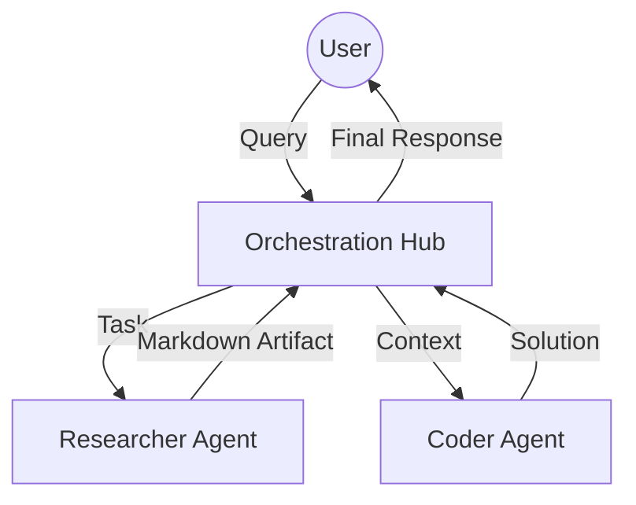

# A2A-MCP-Orchestrator

### Multi-Agent Model Context Protocol (MCP) Orchestration Hub

**A2A-MCP-Orchestrator** is a high-performance orchestration layer designed for **Agent-to-Agent (A2A)** communication. It bridges the gap between independent AI agents by providing a unified protocol for task delegation, artifact exchange, and context sharing.

---

## 🛰 Architecture

The hub acts as a central switchboard, routing tasks from users to specialized agents and managing the resulting data artifacts.



---

## 🛠️ Key Components

### Standardized Artifact Schema

To ensure interoperability, all agents communicate using a unified schema powered by Pydantic:

```python
from pydantic import BaseModel
from typing import Optional

class MCPArtifact(BaseModel):
    artifact_id: str
    type: str  # e.g., 'research_doc', 'code_solution'
    content: str
    metadata: Optional[dict] = None

```

### 🚀 Getting Started

1. **Build and Run Locally**
```bash
docker build -t a2a-hub .
docker run -p 8000:8000 a2a-hub

```


2. **Infrastructure as Code**
To deploy to a production-ready Kubernetes environment, use the following manifest at `k8s/deployment.yaml`:
```yaml
apiVersion: apps/v1
kind: Deployment
metadata:
  name: a2a-mcp-orchestrator
spec:
  replicas: 3
  selector:
    matchLabels:
      app: mcp-hub
  template:
    metadata:
      labels:
        app: mcp-hub
    spec:
      containers:
      - name: orchestrator
        image: a2a-hub:latest
        ports:
        - containerPort: 8000

```


---

## 📂 Capabilities Discovery

This repository utilizes a "virtual folder" structure that allows agents to discover capabilities dynamically. Instead of hard-coding tool paths, agents query the `/capabilities` endpoint to see available MCP servers in the ecosystem.

> **Note:** Ensure your `.env` file contains the necessary API keys for sub-agents (e.g., OpenAI, Anthropic, or local LLM endpoints).
