# MCP Pipeline Extension Route Map

## Purpose

This map names the concrete ingress surfaces, internal dispatch seams, and
runtime handoff points that make up the current MCP pipeline.

Companion diagram:

- `docs/architecture/mcp_extension_route_map.mmd`

Use this document when you need to answer one of these questions:

1. Where does an MCP or compatibility request first enter the system?
2. Which module owns dispatch, auth, and tool registration?
3. Where should a new extension route or tool be added?
4. Which paths are canonical versus compatibility-only?

## Canonical Pipeline

```mermaid
flowchart LR
    Client["Client / Agent / GitHub Action"] --> Gateway["app.mcp_gateway:app"]
    Gateway --> MCP["/mcp (FastMCP transport)"]
    Gateway --> Compat["/tools/call"]
    Compat --> Registry["app.mcp_tooling._TOOL_REGISTRY"]
    Registry --> Protected["Protected tooling\nOIDC + bearer enforcement"]
    Registry --> Public["Public tooling"]
    Public --> Worldline["world_foundation_model.build_worldline_block"]
    Worldline --> Bridge["orchestrator.runtime_bridge.build_handshake_bundle"]
    Bridge --> RuntimeAssign["runtime.assignment.v1 artifact"]
    RuntimeAssign --> RuntimeMCP["a2a_mcp.runtime_mcp_server"]
    RuntimeMCP --> Embed["embed_control_plane"]
    RuntimeMCP --> Assignments["Runtime assignment registry"]
    Tenant["Tenant / Simulator Client"] --> Multi["app.multi_client_api:app"]
    Multi --> Router["src.multi_client_router.MultiClientMCPRouter"]
    Router --> Scenario["src.runtime_scenario_service.RuntimeScenarioService"]
    Scenario --> Verify["Execution lineage + RAG + LoRA routes"]
```

## Route Families

### 1. Canonical MCP gateway

Entrypoint: `app.mcp_gateway:app`

Owned routes:

| Route | Method | Role | Backing seam |
|---|---|---|---|
| `/healthz` | `GET` | Liveness | `app.mcp_gateway.healthz` |
| `/readyz` | `GET` | Readiness | `app.mcp_gateway.readyz` |
| `/mcp` | mounted transport | Native FastMCP ingress | `register_tools(mcp)` |
| `/tools/call` | `POST` | Compatibility HTTP tool dispatch | `call_tool_by_name(...)` |

This is the canonical ingress for MCP tool execution. New gateway-facing tool
capabilities should normally land in the tool registry before adding bespoke
HTTP endpoints.

### 2. Gateway tool registry

Entrypoint: `app.mcp_tooling`

Current tool registry:

| Tool | Protected | Purpose |
|---|---:|---|
| `ingest_repository_data` | Yes | OIDC-bound repository snapshot ingestion |
| `ingest_avatar_token_stream` | Yes | Token shaping and namespace validation |
| `build_local_world_foundation_model` | No | Worldline/world-foundation payload generation |
| `get_coding_agent_avatar_cast` | No | Avatar binding export |

Key extension seam:

1. Add the implementation function in `app.mcp_tooling`.
2. Register it in `_TOOL_REGISTRY`.
3. Decide whether it is `protected`.
4. Prefer exposing it through `/mcp` and `/tools/call` instead of creating a
   parallel FastAPI route.

### 3. Worldline and runtime handoff

Core modules:

- `world_foundation_model.py`
- `orchestrator/runtime_bridge.py`

The worldline path is the canonical route for prompt-to-runtime materialization:

1. `build_worldline_block(...)` creates the deterministic worldline payload.
2. The payload includes `github_mcp_tool_call`, which currently targets
   `POST /tools/call`.
3. `build_handshake_bundle(...)` hydrates token streams, artifact clusters, DMN
   globals, kernel release-control metadata, and `runtime.assignment.v1`.
4. The runtime assignment artifact is the handoff contract into runtime workers
   and runtime MCP.

Best extension seams:

| Need | Extend here | Why |
|---|---|---|
| New worldline metadata | `world_foundation_model.build_worldline_block` | Keeps generation deterministic and centrally shaped |
| New runtime assignment fields | `orchestrator.runtime_bridge._build_runtime_assignment` | Preserves the assignment contract |
| New worker/runtime metadata | `orchestrator.runtime_bridge._build_worker_assignments` | Keeps runtime-worker schema coherent |
| New DMN/kernel globals | `orchestrator.runtime_bridge._build_dmn_global_variables` | Keeps release-control wiring explicit |

### 4. Runtime MCP tool plane

Entrypoint: `a2a_mcp/runtime_mcp_server.py`

Registered tools:

| Tool | Role | Backing seam |
|---|---|---|
| `submit_runtime_assignment` | Store runtime assignment artifacts | `_RUNTIME_ASSIGNMENTS` |
| `get_runtime_assignment` | Fetch one assignment | `_RUNTIME_ASSIGNMENTS` |
| `list_runtime_assignments` | List/filter assignments | `_RUNTIME_ASSIGNMENTS` |
| `embed_submit` | Queue deterministic embed job | `embed_control_plane.py` |
| `embed_status` | Query embed progress | `embed_control_plane.py` |
| `embed_lookup` | Resolve stored embedding artifact | `embed_control_plane.py` |
| `embed_dispatch_batch` | Worker-only artifact write path | `embed_control_plane.py` |
| `route_a2a_intent` | Intent-to-tool compatibility router | `embed_control_plane.py` |

Best extension seams:

| Need | Extend here | Guardrail |
|---|---|---|
| New runtime MCP tool | `a2a_mcp/runtime_mcp_server.py` | Register directly on `FastMCP("A2A_Runtime")` |
| New embed job lifecycle step | `embed_control_plane.py` | Keep receipt chaining intact |
| New A2A intent | `route_a2a_intent(...)` | Only route to backed tool surfaces |
| New runtime assignment storage | Replace `_RUNTIME_ASSIGNMENTS` backing store | Preserve `RuntimeAssignmentV1` contract |

### 5. Tenant and simulator extension routes

Entrypoint: `app.multi_client_api:app`

Owned routes:

| Route | Method | Role | Backing seam |
|---|---|---|---|
| `/healthz` | `GET` | Liveness | FastAPI health route |
| `/mcp/register` | `POST` | Tenant/client registration | `MultiClientMCPRouter.register_client` |
| `/mcp/{client_id}/baseline` | `POST` | Baseline embedding setup | `set_client_baseline` |
| `/mcp/{client_id}/stream` | `POST` | Tenant-scoped ingress + scenario creation | `process_request` + `RuntimeScenarioService.create_scenario` |
| `/a2a/handshake/init` | `POST` | Start A2A handshake | `A2AHandshakeService.init_handshake` |
| `/a2a/handshake/exchange` | `POST` | Exchange tools/scopes/tokens | `A2AHandshakeService.exchange_handshake` |
| `/a2a/handshake/finalize` | `POST` | Finalize and clear volatile tokens | `A2AHandshakeService.finalize_handshake` |
| `/a2a/handshake/{handshake_id}` | `GET` | Read handshake envelope | `A2AHandshakeService.get_handshake` |
| `/a2a/runtime/{client_id}/scenario` | `POST` | Build runtime scenario envelope | `RuntimeScenarioService.create_scenario` |
| `/a2a/scenario/{execution_id}/rag-context` | `POST` | Build retrieval context | `RuntimeScenarioService.build_rag_context` |
| `/a2a/scenario/{execution_id}/lora-dataset` | `POST` | Build LoRA dataset candidates | `RuntimeScenarioService.build_lora_dataset` |
| `/a2a/executions/{execution_id}/verify` | `GET` | Verify lineage chain | `RuntimeScenarioService.verify_execution` |

These are the main extension routes for tenant-facing integrations, simulator
frontends, and execution-verification tooling.

## Extension Decision Tree

Use the smallest extension seam that preserves the canonical contracts:

| If you need to add... | Start here | Avoid |
|---|---|---|
| A new canonical MCP tool | `app.mcp_tooling._TOOL_REGISTRY` | Adding a one-off FastAPI route first |
| A new runtime worker tool | `a2a_mcp/runtime_mcp_server.py` | Re-implementing embed/runtime logic under `app/` |
| A new embed or receipt stage | `embed_control_plane.py` | Bypassing receipts or writing ad hoc job state |
| A new worldline payload field | `world_foundation_model.py` | Injecting fields later in unrelated routes |
| A new handshake/runtime assignment field | `orchestrator/runtime_bridge.py` | Mutating runtime artifacts downstream |
| A new tenant/simulator flow | `app.multi_client_api.py` + `src/multi_client_router.py` | Bolting tenant state onto the canonical gateway |
| A new verification or scenario export route | `app.multi_client_api.py` + `src/runtime_scenario_service.py` | Mixing simulator concerns into `app.mcp_gateway` |

## Route Ownership Map

| Concern | Canonical owner | Compatibility / adjacent owner |
|---|---|---|
| Native MCP ingress | `app.mcp_gateway` | `mcp_server.py` |
| HTTP compatibility tool calls | `app.mcp_gateway:/tools/call` | legacy callers only |
| Protected ingestion auth | `app.mcp_tooling` + `app.security.oidc` | none |
| Worldline payload generation | `world_foundation_model.py` | none |
| Runtime handoff / assignment contract | `orchestrator.runtime_bridge` | none |
| Runtime MCP tools | `a2a_mcp.runtime_mcp_server` | stdio/runtime-only clients |
| Embed job lifecycle | `embed_control_plane.py` | `route_a2a_intent` compatibility shim |
| Tenant isolation / drift gates | `src.multi_client_router.py` | none |
| Scenario, RAG, LoRA, lineage verification | `src.runtime_scenario_service.py` | `app.multi_client_api.py` HTTP facade |

## Practical Extension Recipes

### Add a new canonical MCP tool

1. Implement the tool in `app.mcp_tooling.py`.
2. Register it in `_TOOL_REGISTRY`.
3. Decide whether bearer/OIDC protection is required.
4. Call it through `/mcp` or `/tools/call`.
5. If runtime workers also need it, add a mirrored runtime-tool entry only when
   the runtime plane truly needs independent access.

### Add a new runtime/embed tool

1. Implement the logic in `embed_control_plane.py` or a dedicated runtime
   service.
2. Register it in `a2a_mcp/runtime_mcp_server.py`.
3. If it maps from A2A intents, add the intent mapping in
   `route_a2a_intent(...)`.
4. Keep the receipt chain or assignment contract deterministic.

### Add a new tenant-facing extension route

1. Add the FastAPI route in `app.multi_client_api.py`.
2. Keep orchestration state in `src.multi_client_router.py`,
   `src.runtime_scenario_service.py`, or `app.services.handshake_service.py`.
3. Reuse existing tenant boundaries, drift checks, and lineage verification
   instead of creating a side cache.

## Non-Canonical Paths

These still exist, but they should not be the first extension target for new
pipeline work:

- `orchestrator.main`
- `app.main`
- `mcp_server.py`
- direct webhook-only runtime paths

## Related Docs

- `docs/architecture/canonical_control_plane.md`
- `docs/architecture/mcp_extension_route_map.mmd`
- `docs/MCP_SERVER_VS_CLIENT_API.md`
