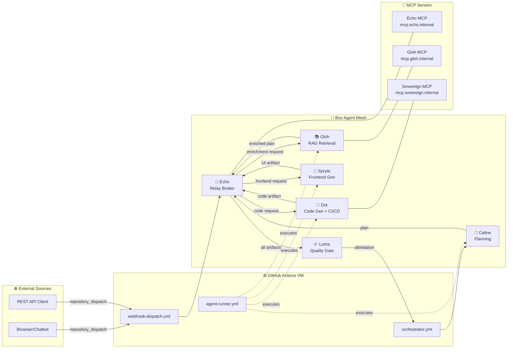

# Webhook Topology — Echo Relay Mesh

All inter-agent messages route through Echo's MCP endpoint.
External webhooks (browsers, chatbots) enter via `repository_dispatch`.



## Webhook Flow

1. **Ingress**: External sources send `POST /repos/{owner}/{repo}/dispatches` with `event_type` and `client_payload`
2. **Route**: `webhook-dispatch.yml` extracts `to_agent` from payload and routes to the correct agent
3. **Execute**: Agent runs on the GitHub Actions VM via `runner.py`
4. **Relay**: Echo wraps output in an A2A envelope and fires `repository_dispatch` to the next agent
5. **Attest**: Luma validates all receipts and signs the attestation
6. **Artifacts**: All outputs uploaded as GitHub Actions artifacts

## OS-Agnostic Webhook Trigger

```bash
# From any OS, browser, or chatbot — trigger the pipeline:
curl -X POST \
  -H "Authorization: Bearer $GITHUB_TOKEN" \
  -H "Accept: application/vnd.github+json" \
  https://api.github.com/repos/{owner}/{repo}/dispatches \
  -d '{"event_type":"chat-trigger","client_payload":{"task_id":"T-chat","to_agent":"Celine","payload":{"prompt":"Build a login page"}}}'
```
