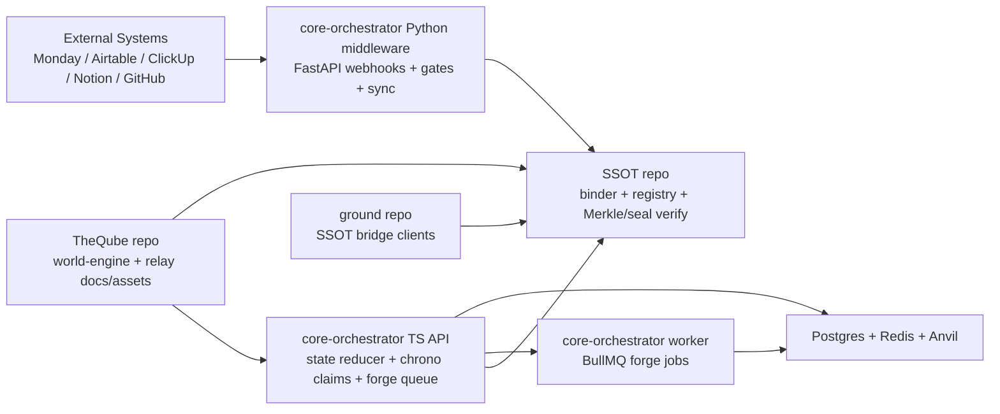

# Cross-Repo System Map

## Repos in scope

- `core-orchestrator` (runtime/control plane + middleware + game API + web + worker)
- `SSOT` (proof/ledger plane + binder + verification + registry capsules)
- `TheQube.L0Q3R-nosmudge` (world-engine and emulator experiments, includes mirrored orchestrator assets)
- `ground` (UI/simulation playground with bridge clients into SSOT-style APIs)

## System topology

## Integration points traced to source

### 1) Middleware ingestion and gating

- Webhook ingress:
  - `core-orchestrator/app/routes/webhooks.py`
- Normalization:
  - `core-orchestrator/app/services/normalize.py`
- Gate evaluation:
  - `core-orchestrator/app/services/gates.py`
- Sync + audit writes:
  - `core-orchestrator/app/services/sync.py`

### 2) Runtime/API and deterministic state

- API service:
  - `core-orchestrator/apps/api/src/index.ts`
- State and action storage:
  - `core-orchestrator/apps/api/prisma/schema.prisma`
- Asset forge queue producer:
  - `core-orchestrator/apps/api/src/index.ts`
- Asset forge queue consumer:
  - `core-orchestrator/apps/worker/src/index.ts`

### 3) SSOT contract and verification hooks

- SSOT binder runtime:
  - `SSOT/ssot/binder.py`
- Registry federation capsule:
  - `SSOT/capsules/capsule.world.registry.v1.json`
- Validation/sealing scripts:
  - `SSOT/verify/README.md`
  - `SSOT/verify/schema-validator.js`
  - `SSOT/verify/seal_attestation.js`
- Cross-check from orchestrator:
  - `core-orchestrator/scripts/validate_ssot.py`
  - `core-orchestrator/scripts/check_drift.py`

### 4) Cross-repo bridge client examples

- Ground -> SSOT bridge:
  - `ground/public/bridge/ssot_bridge.ts`
- TheQube references to orchestrator lineage:
  - `TheQube.L0Q3R-nosmudge/Q`
  - `TheQube.L0Q3R-nosmudge/adaptco-core-orchestrator/src/audit.js`

## Current reality and coupling notes

- `core-orchestrator` contains multiple stacks (Python middleware + TS monorepo + legacy/mirrored subtrees), so ownership boundaries are currently mixed.
- `SSOT` is the canonical "proof plane" in code and docs; many orchestrator docs/scripts already assume SSOT manifests and drift checks.
- `ground` and `TheQube` currently integrate at the contract/data level (capsules, bridge payloads, ledger semantics), not through a single shared package.
